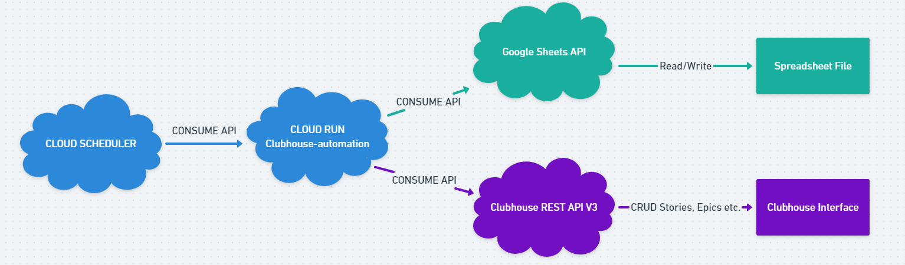

# Clubhouse Automation

An [Express](https://expressjs.com/) application to automate process in Clubhouse using their API and Google Spreadsheet.

> **Note:** It's a personal project. Here are the [steps](#development) if you want to test or use it for your own needs.

## Features

At the moment there are two features.

### Book feature: Create an epic from the title of a book and the chapter's book as stories
Write in the spreadsheet the title of the book, the author and the chapters.
The app will create:
- An epic with the title of the book and the author in the description.
- As many stories as their are chapters. Stories will be attached to the book epic.
- The epic and stories will have "Book" label attached to them.

> **Note:** For the moment, you will have to create or have a project called "Reading" in your Clubhouse.

Here's the [spreadsheet template](https://docs.google.com/spreadsheets/d/1oHin1tiFc_mIUD7t2JKsQQYSs9nuDmM3yyffLHODunk/edit#gid=309331420).

### Articles feature: Create stories from a list of articles
Write in the spreadsheet the article's title, a description and the url of the article.
The app will create:
- As many stories as their are articles.
- Stories will have "Article" label attached to them.

> **Note:** For the moment, you will have to create or have a project called "Reading" in your Clubhouse.

Here's the [spreadsheet template](https://docs.google.com/spreadsheets/d/1oHin1tiFc_mIUD7t2JKsQQYSs9nuDmM3yyffLHODunk/edit#gid=0).

### Next to come
- **Docker:** Dockerize the application
- **Completely automate the process:** Deploy to Google Cloud Platform with a private Cloud Run and use Cloud Scheduler to consume the API.
- **Videos feature:** Create stories from a list of videos.

### Nice to have
- Possibility to write the project name in the spreadsheet and create it or not in Clubhouse if project doesn't exist.
- Possibility to enter labels to be attached to epics and stories.
- Possibility to control spreadsheet ranges in the document and not in the code.
- Swagger to document the API.
- Extends the parameters like setting the due date in the spreadsheet.
- Logging (maybe in Stackdriver)

## What's [Clubhouse](https://clubhouse.io/) ?

> Clubhouse is the first project management platform for software development that brings everyone on every team together to build better products. — Clubhouse

Thinking of **Jira** ? I was thinking the same. But I prefer Clubhouse for it's simplicity.

It's a very good product and I encourage you to check it out. If you're alone or have a small team, they have an amazing [free plan](https://clubhouse.io/blog/free-plan).   

## Why this project ?

I was searching for a tool to help with my productivity to get things done to advance in my personnal goals. I needed smaller and concrete actions to have a step by step process. I needed to store all of that somewhere, follow my progression and the possiblity to share it with friends.

In my daily work, I use Jira and at first I was thinking to go with it. But I wanted something more simple. I heard about Clubhouse and decided to try it. After a period of trial, it met my needs and I was impressed by their product so I started using it more seriously.

I stumbled in a situation where I wanted a book to read as an epic with the chapters's book as stories attached to the epic. If you have a lot of books, it becomes tedious to create the epic then all of the stories and attached it to the epic. Even with the duplication functionality. So, I needed to find a way to automate that.

And to my surprise, Clubhouse have an [API](https://clubhouse.io/api/rest/v3/) and a good one that made automation possible.

## Then came the project Clubhouse Automation

In the end, I came with the idea to combine with Google Spreadsheet. I write down the book's title and chapters in the spreadsheet and the app will get the data to create the epic and stories.

I also have a lot of articles to read. Again, I write them in my spreadsheet and the app will create associated stories. I can even share my spreadsheet for other people to write down an article that might interest me.

For now, I only want these two features but you can have as many features that will suit your needs.

The final step will be to deploy the app in GCP with a private Cloud Run and use Cloud Scheduler to schedule a job to completely automate the process. For example, it will be possible to have a job that will get the list of articles in the spreadsheet and create associated stories every two days. I'll only have to work with the spreadsheet and everything will be in my Clubhouse !

## Development

> **Warning**: It's not optimized for production YET. Code needs to be cleaned and tested.

I started with my template [Express Starter](https://github.com/Wraithraiser/express-starter).

Clone the project and create your `.env` file by doing a copy of `.env.dist` :
```sh
cp .env.dist .env
```

Install the dependencies:
```sh
yarn install
```

Launch the project in two consoles:
```sh
yarn watch
yarn dev
```

Now you have the app in watch mode running on `http://localhost:3000/`.

You'll have to complete the env variables with your settings:
```sh
CLUBHOUSE_API_TOKEN=
GOOGLE_APPLICATION_CREDENTIALS=[PATH]
SHEET_ID=
```

Use `curl` or [Postman](https://www.getpostman.com/) with **HTTP POST** to consume the API:
- http://localhost:3000/api/automate/book => For [book feature](#book-feature-create-an-epic-from-the-title-of-a-book-and-the-chapters-book-as-stories)
- http://localhost:3000/api/automate/articles => For [articles feature](#articles-feature-create-stories-from-a-list-of-articles)

> **Note:** If you don't know how to complete the two env variables `GOOGLE_APPLICATION_CREDENTIALS` and `SHEET_ID` I will (hopefully) soon write a serie of articles to explain how I build the app.

## Architecture



### License

Clubhouse Automation is [ISC licensed](./LICENSE).
